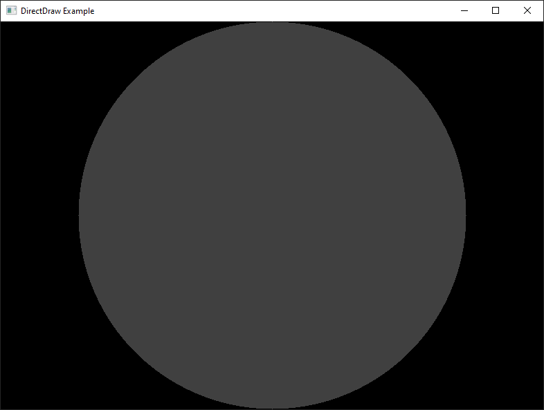

## DirectDraw Example

An example of DirectDraw rendering:
1. `Window.cxx` - window mode.
2. `Screen.cxx` - full screen mode.

### Build
Configure the build:
1. Enable Unicode support.
2. Link with `ddraw.lib` and `dxguid.lib`.

### Visual

### See Also
1. [GDI Example](https://github.com/EugeneKirian/GDIExample)

